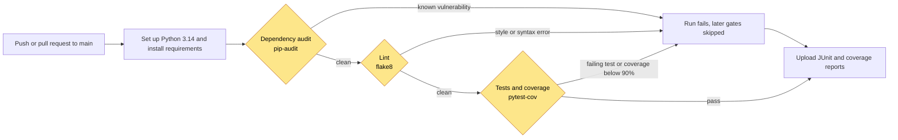
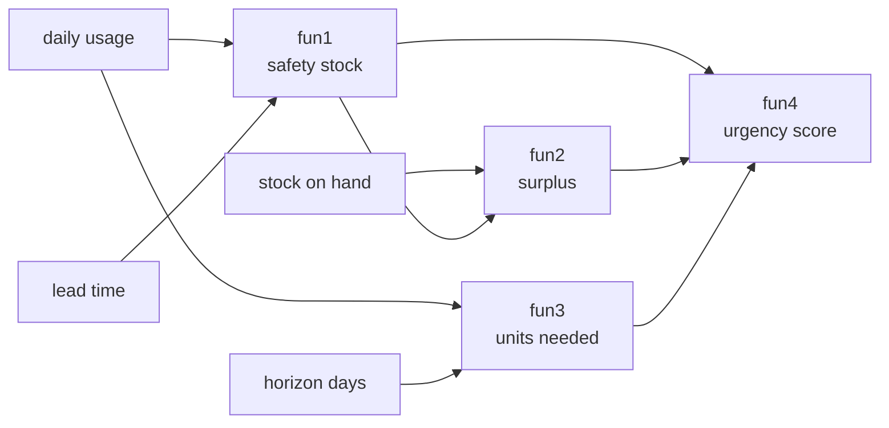

# IE7374 Lab 1: GitHub Actions CI/CD Pipeline

[](https://github.com/lequo-neu/IE7374-Github-Lab1/actions/workflows/pytest_action.yml)
[](https://github.com/lequo-neu/IE7374-Github-Lab1/actions/workflows/unittest_action.yml)

A CI/CD pipeline that checks every push and pull request to main through four
gates in a fixed order: a dependency security audit, a lint check, the test
suite with a coverage threshold, and an upload of the test and coverage reports.
A failure at any gate stops the run before the next one starts. The badges above
show the live status of both workflows.

## At a Glance

| What to check | Answer |
|---|---|
| Based on | Github_Labs/Lab1 from the course repository |
| Core concept changed | The CI workflow itself: three new gates and a workflow that GitHub actually accepts. See [Changes Made to the Lab](#changes-made-to-the-lab) |
| Advanced extension | Automated dependency security audit with pip-audit. See [Advanced Extension](#advanced-extension-automated-dependency-security-audit) |
| Proof that it runs | The badges above, the Actions tab, and the downloadable reports on every run. See [What a Successful Run Looks Like](#what-a-successful-run-looks-like) |
| Run it yourself | Four commands. See [Running the Code Locally](#running-the-code-locally) |

## How the Pipeline Works

Every push or pull request to main starts two workflows at the same time. The
main one, Testing with Pytest, runs the gates below. Yellow boxes are the gates
added in this version.



The report upload runs even when an earlier gate fails, so the evidence of what
went wrong is always available to download. The second workflow, Python
Unittests, runs the standard library unittest suite on its own as an
independent check.

## Changes Made to the Lab

| Area | Original Lab 1 | This version |
|---|---|---|
| Workflow validity | Rejected by GitHub before running: branches and branches-ignore set on the same event, and a misspelled run-name key | Valid workflow that runs on every push and pull request to main |
| Action versions | checkout v2, setup-python v2, upload-artifact v2, all deprecated | checkout v4, setup-python v5, upload-artifact v4 |
| Python | 3.8, past end of life | 3.14 |
| Gates before testing | None | Dependency audit, then lint |
| Test reporting | JUnit XML only | JUnit XML plus a line by line coverage report, and the build fails below 90% coverage |
| Code under test | Add, subtract, multiply, sum of three | Supply chain calculations for drug shortage planning |
| Error handling | Validation code existed but was never tested | Every validated function is tested with non numeric input |

**The workflow**

The original pytest workflow never ran. GitHub refuses a workflow that sets both
branches and branches-ignore on the same event, and the file also contained a
misspelled run-name key and triggers for issues and labels that had nothing to do
with testing. The triggers were rewritten to push and pull request on main, and
all actions were moved to their current major versions.

Three gates were then added in front of and around the tests. The dependency
audit is described in the Advanced Extension below. The lint gate runs flake8
over src/ and test/ and stops the run on any style or syntax problem. The test
gate runs pytest with pytest-cov, writes a JUnit report and a coverage report,
and fails the build if line coverage drops below 90 percent. Without that
threshold, a coverage report is only information. With it, untested code can no
longer be merged quietly.

**The code under test**

The four arithmetic functions were replaced with calculations used when planning
around a drug shortage, the domain of my course project. The function names stay
the same so the structure of the original lab is still easy to follow.

| Function | Meaning | Formula | Example |
|---|---|---|---|
| fun1 | Safety stock needed to cover the reorder lead time | daily_usage * lead_time_days | fun1(10, 3) returns 30 |
| fun2 | Surplus above safety stock, negative when below it | stock_on_hand - safety_stock | fun2(10, 30) returns -20 |
| fun3 | Units needed over a forecast horizon | daily_usage * horizon_days | fun3(10, 7) returns 70 |
| fun4 | Combined urgency score | safety_stock + surplus + units_needed | fun4(30, 20, 70) returns 120 |



**The tests**

The original validation code in fun1, fun2 and fun3 raised an error for non
numeric input, but no test ever reached those lines. New tests pass a string, a
None and a list to each of those functions and expect the error, which brings line
coverage of src/calculator.py to 100 percent. The same cases were added to the
unittest suite.

## Advanced Extension: Automated Dependency Security Audit

**Why this was chosen**

A pipeline that only checks whether the code works gives a false sense of
safety. Code can pass every test and still ship a known vulnerability through one
of its dependencies. Machine learning projects are especially exposed, because
they depend on large scientific libraries with deep dependency trees, and one
outdated package can put the whole system at risk. Checking dependencies inside
the pipeline catches a vulnerable package on the commit that introduces it,
instead of months later in a security review.

pip-audit was chosen because it is maintained under the Python Packaging
Authority. It checks every installed version against the Python Packaging
Advisory Database and the Open Source Vulnerabilities database, runs in seconds,
and reports in a format that fits a CI log.

**How it works**

The audit runs right after the dependencies are installed and before any code is
looked at. The order is deliberate: there is little point in linting or testing
code inside an environment that is already known to be unsafe. pip-audit resolves
every package in requirements.txt, including the packages they depend on, and
compares each version against the advisory databases.

If a match is found, it prints the package, the installed version, the advisory
identifier and the version that fixes it, then exits with a non zero code. GitHub
Actions marks the run as failed and skips the lint and test gates. The fix is to
upgrade to the patched version, or, if no fix exists yet, to accept the finding
explicitly with a documented reason.

**What it produces**

A green run now means more than passing tests. It also means none of the
dependencies had a known vulnerability at the time of that commit. In a team, this
takes dependency checking out of code review entirely, because the pipeline does
it on every push.

## Prerequisites

Python 3.14. Download from https://www.python.org/downloads and verify with:
python3 --version

Git. Download from https://git-scm.com and verify with: git --version

All Python packages are listed in requirements.txt: pytest, pytest-cov, flake8
and pip-audit.

## Environment Setup

Clone the repository.

```
git clone https://github.com/lequo-neu/IE7374-Github-Lab1.git
cd IE7374-Github-Lab1
```

Create and activate a virtual environment, then install the dependencies.

```
python3 -m venv lab_01
source lab_01/bin/activate
pip install -r requirements.txt
```

## Running the Code Locally

These are the same commands the pipeline runs, in the same order.

```
pip-audit -r requirements.txt --format=columns
flake8 src/ test/ --max-line-length=100 --ignore=E203,W503
pytest test/test_pytest.py --cov=src --cov-report=term-missing --cov-fail-under=90 -v
python -m unittest test.test_unittest -v
```

## What a Successful Run Looks Like

| Gate | Command | Successful result |
|---|---|---|
| Dependency audit | pip-audit | No known vulnerabilities found |
| Lint | flake8 | No output at all |
| Tests and coverage | pytest | 13 passed, 100% line coverage, above the 90% gate |
| Unittest suite | unittest | 5 tests, all ok |

The audit finds nothing to report.

```
No known vulnerabilities found
```

The test gate runs 13 tests. Nine of them come from one parametrized test that
feeds three kinds of invalid input to each of the three validated functions.

```
test/test_pytest.py::test_fun1 PASSED
test/test_pytest.py::test_fun2 PASSED
test/test_pytest.py::test_fun3 PASSED
test/test_pytest.py::test_fun4 PASSED
test/test_pytest.py::test_rejects_non_numeric_input[bad_args0-fun1] PASSED
test/test_pytest.py::test_rejects_non_numeric_input[bad_args0-fun2] PASSED
test/test_pytest.py::test_rejects_non_numeric_input[bad_args0-fun3] PASSED
test/test_pytest.py::test_rejects_non_numeric_input[bad_args1-fun1] PASSED
test/test_pytest.py::test_rejects_non_numeric_input[bad_args1-fun2] PASSED
test/test_pytest.py::test_rejects_non_numeric_input[bad_args1-fun3] PASSED
test/test_pytest.py::test_rejects_non_numeric_input[bad_args2-fun1] PASSED
test/test_pytest.py::test_rejects_non_numeric_input[bad_args2-fun2] PASSED
test/test_pytest.py::test_rejects_non_numeric_input[bad_args2-fun3] PASSED

Name                Stmts   Miss  Cover   Missing
-------------------------------------------------
src/__init__.py         0      0   100%
src/calculator.py      14      0   100%
-------------------------------------------------
TOTAL                  14      0   100%
Required test coverage of 90% reached. Total coverage: 100.00%
13 passed in 0.03s
```

The unittest suite covers the same cases.

```
test_fun1 (test.test_unittest.TestCalculator.test_fun1) ... ok
test_fun2 (test.test_unittest.TestCalculator.test_fun2) ... ok
test_fun3 (test.test_unittest.TestCalculator.test_fun3) ... ok
test_fun4 (test.test_unittest.TestCalculator.test_fun4) ... ok
test_rejects_non_numeric_input (test.test_unittest.TestCalculator.test_rejects_non_numeric_input) ... ok

Ran 5 tests in 0.000s
```

On GitHub, both badges at the top of this page are green, and the Actions tab
lists every run. Opening a run of Testing with Pytest shows each gate as a
separate step, and the Artifacts section at the bottom of the run page holds
pytest-report.xml and coverage.xml for download.

## Project Structure

```
IE7374-Github-Lab1/
    .github/
        workflows/
            pytest_action.yml      (audit, lint, tests with coverage gate, reports)
            unittest_action.yml    (independent unittest run)
    src/
        __init__.py
        calculator.py              (supply chain calculations)
    test/
        __init__.py
        test_pytest.py             (13 tests including invalid input cases)
        test_unittest.py           (5 tests, same cases in unittest style)
    .gitignore
    README.md
    requirements.txt
```
